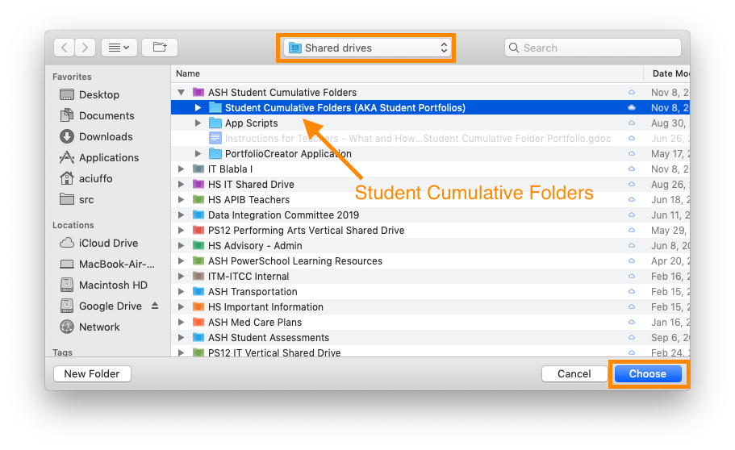
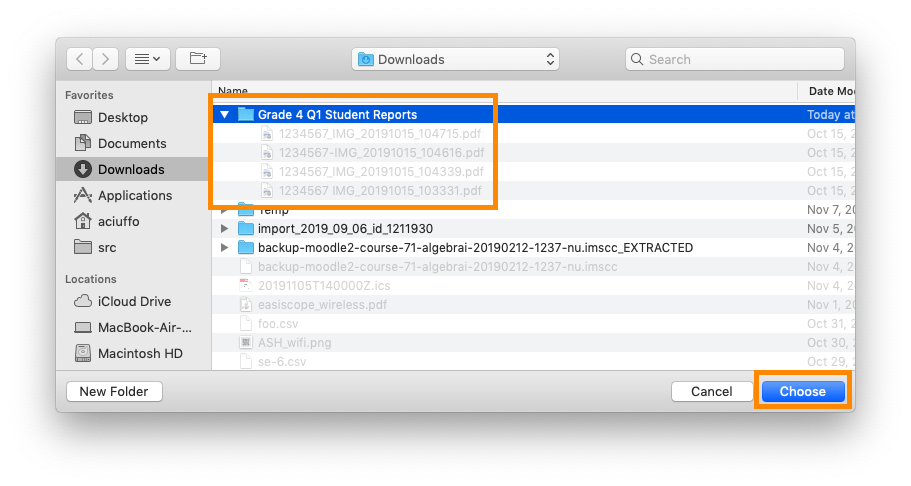
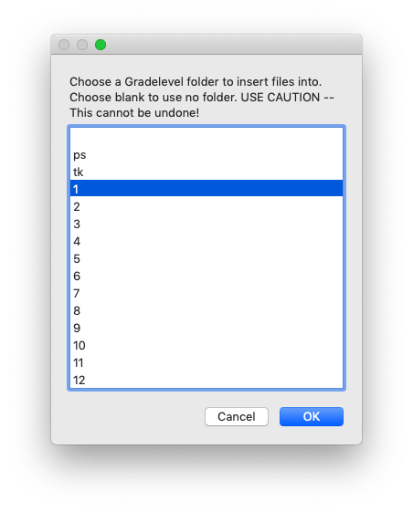
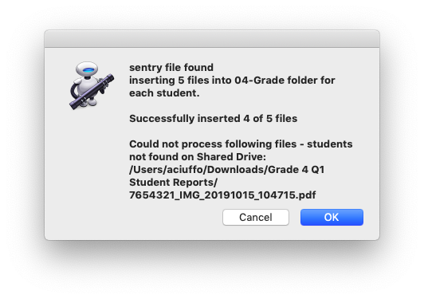

# insertFiles
Distribute multiple files into appropriate cumulative student folders on a google Shared drive (formerly Team Drive)

insertFiles.app/script accepts one or more files that contain a PowerSchool student number; the supplied files are copied into the student portfolio folder. Any files with the same name will be overwritten with the newest upload.

Any files that failed to copy will be listed.

## Installation and Configuration Requirements
1. [Google Filestream](https://support.google.com/a/answer/7491144?hl=en)
   * Filestream is signed in with an account with editing rights to the Student Cumulative folders Shared Drive
2. [InsertFiles.app](https://github.com/txoof/insertFiles/blob/master/insertFiles.app.zip)
   * Application can be moved to any location in the user's home folder

## Use
This application expects one or more files that contain the student number in the FILE NAME. File names can be in any configuration, but **must ONLY contain the student number once**. 

### OS X Application
* Launch the Application by double clicking
  * Note that any files inserted with this application **cannot** be undone. Use this with caution!
* When prompted, locate the Google Drive - Shared drive folder that contains the student cummlative folders:
  * 
* Select a folder with Progress Reports, Report Cards, etc. that are labeled with student id numbers:
  * 
* Select a grade level folder to insert the files. In this example *Grade 4 Q1 Reports* were selected, so the appropriate grade level folder is ***4***
  * 
* A report will be generated showing files that were **not** inserted:
    * 


### Command Line Use
`./insertFiles.zsh [--GradeLevel (optional)] /Folder/With/Files/*.foo`

### Valid GradeLevel options:
* -g ps (preschool)
* -g tk (transition kindergarden)
* -g kg (kindergarten)
* -g 1..-g 12

**Valid Filename Formats**
Valid filenames must contain a valid student number somehwere in the filename
* `SPR_DoeJohn_324566.pdf` 
* `ISA_Autumn-345566-Doe Jon.pdf`
* `555457 John Doe.PDF`
* `334577.doc`
* `S1 Grade 4 Progress Report - Yeats, John_778654.pdf`

**Invalid Filename Formats**
Filenames that do not contain the student number or contain more than one set of numbers will not be processed.
* `20182019_ISA Test Results_443556.pdf` ↢ Too many numbers
* `John Doe.pdf` ↢ No student number
* `20192020 Grade 4 S1 Report Card 5566893 Komenyaka, Useff.pdf` ↢ Too many numbers

### Examples
*  Use the command below to insert all PDF files in the folder ~/Downloads/Grade-5-Map-Results/ into each student's Cumulative folder:
   - `./insertfiles.zsh ~/Downloads/Grade5-Map-Results/*.pdf`
*  Use the command below to insert individual files into the root folder of each student - this is usefulf for MAP tests
   -  `./insertFiles.zsh File1_555663.pdf File2_334567.pdf FileN_223416.pdf`
   -  This command will add File1_555663 into the Shared Drive (formerly Team Drive) ASH Student Cumulative Folders/Student Cumlative Folders (AKA Student Portfolios)/Class of 2099/Washington, George - 555663/
* Insert all PDF files in folder "grade 4 Report Cards"  into a the 04-Grade folder
   -  `./insertFiles.zsh --4 ~/Downloads/grade 4 Report Cards/*.pdf`
   -  This command will add each individual report card stored in the Downloads/grade 4 Report Cards/ folder into the folder ASH Student Cumulative Folders/Student Cumlative Folders (AKA Student Portfolios)/Class of 2099/Washington, George - 555663/04-Grade
   
## Trouble Shooting
### Problem- "Fatal Error" message
`FATAL ERROR
Sentry file is missing from ASH Student Cumulative Folders`

There is a file that exists in the Shared drive (formerly team drive) called "`sentryFile_DO_NOT_REMOVE.txt`" The program will not opperate if the file is missing. 

### Solutions
#### Check that Filestream is running
1.  Look for the FileStream icon in the menu bar at the top of the screen 
2.  If the icon does not appear, use finder to locate the FileStream application and launch it 

#### Check that you are signed in
1.  Click on the FileStream icon and check that you are signed in with an account that can access the appropriate Shared Drive


#### Check that the Sentry File Exists
1.  Browse to the Shared Drive on google Drive and check if the file "`sentryFile_DO_NOT_REMOVE.txt`" is located in the top level Folder that contains the cummulative folders of the Shared Drive.
2.  If the file is missing or does not have the proper name, recreate it using the following command from a Terminal prompt:
   * `touch "/Volumes/GoogleDrive/Shared\ drives/DRIVE NAME/PATH TO STUDENT CUMULATIVE FOLDER/sentryFile_DO_NOT_REMOVE.txt"`

### Problem- recieve the following message:
```
insertFiles inserts multiple test files into a Google Shared drive
folder based on student numbers

command line usage:
insertFiles -p "/path/to/GoogleDrive/shared drive/Student Cumlative Folders/Cumlative Folder" [-g GradeLevel] StudentID-File1 FileN-StudentID
insertFiles -p "/path/to/GoogleDrive/shared drive/Student Cumlative Folders/Cumlative Folder" [-g GradeLevel] /path/to/files/.*

GradeLevel: ps, tk, kg, 1, 2, 3, 4, 5, 6, 7, 8, 9, 10, 11, 12
```
### Solutions:
#### Supply files for the program to work with:
1.  Make sure you are supplying a folder of files for the program to work with. Try typing or pasting the following command
   *  `./insertFiles.zsh ~/D`
2.  Then press the TAB key (⇥) twice to show all of the possible folders that start with "D":
```
$ ./insertFiles.zsh ~/D
Desktop/   Documents/ Downloads/
```
3.  Type a few more characters and press the TAB key again to complete the line. 
4.  Repeat steps 2 and 3 until you have the right folder.
5.  Add `*.pdf` at the end of the line to select all (\* = ALL) the PDFs in that folder: `./insertFiles.zsh ~/Downloads/grade\ 3 MAP Results/*.pdf`

#### Use valid Grade Level Options:
1.   Make sure you supply a valid grade level folder option FIRST. It must be the first option after the command: `./insertFiles.zsh --3  ~/Downloads/grade\ 3 reports/*.pdf`
2. Valid Grade level options: --ps, --tk, --kg, --1, --2, --3 .. --12

### Problem- receive message: Could not process the following files...
```
Could not process the following files - no student number in name:
/Users/aciuffo/Downloads/g3test/foo.pdf
```
### Solution:
1.  One or more of the PDFs do not have valid looking student numbers in the file name. The file "`foo.pdf`" is missing a student number all together. Rename the file to include the student number.

### Problem- receive the message: Could not process following files...
```
Could not process following files - students not found on Shared Drive:
/Users/aciuffo/Downloads/g3test/SPR_van KattenBillie_5033479.pdf
```
### Solution
1.  Only students with cumulative/portfolio folders on the Google Shared Drive can be processed. Billie van Katten (SN 5033479) does not have a student folder.
2.  Create a folder for Billie van Katten and try again


