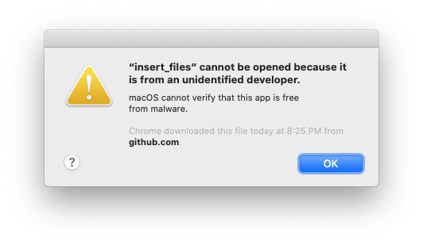
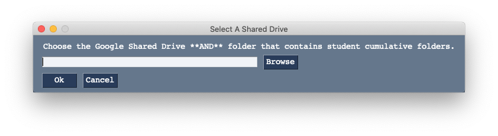

# insert_files
insert_files files into Student Cumulative Folders on Google Drive
Previous versions can found [here](https://github.com/txoof/insertFiles/tree/development/Automator_version)

## Quick Start

1. [Google FileStream](https://dl.google.com/drive-file-stream/GoogleDriveFileStream.dmg) installed and are signed in as well as a prepared student.export file from PowerSchool.
1. Download the application from [this link](https://github.com/txoof/insertFiles/raw/master/insert_files.tgz)
2. Locate the file `insert_files.tgz` -- likely in your `Downloads` folder
3. Double click on the file to decompress it
4. Locate the insert_files icon and drag it into your `Applications` folder
5. Locate the insert_files icon in your `Applications` folder and double click on it to run
    * If you receive error messages or popups preventing you from running the application see the [Help](#Help) section
6. Click "Insert Files" button to begin inserting files.
7. If this is the first time you have run this program, you will be asked to choose a Google Shared drive **and** cumulative student folder. 
    * If you are unsure how to do this, see the [Help](#Help) section
8. Browse to a folder that contains files to be inserted and click "OK"
   * Each of these files will be inserted into the same grade-level folder for each student
9. Next select a grade level folder -- the selected files will be deposeted into that folder for each student
10. Repeat as needed

## Instructions

### Getting Started
You must have google File Stream installed and a user that has `Contributor` permissions must be signed in before using this program. See [Help: Setting up FileStream ] below(#SetupFilestream). 

The first time you run insert_files, you must specify the Shared Drive **AND** the student cumulative folder. Once you have set this up the first time, it is not necessary to chage this setting unless the name of the drive or folder chagnes. See [Choosing the Shared Drive and Cumulative Student Folder](#ChooseSharedDrive) below for help.

### Preparing Files to be Inserted

Create a folder with individual files that will be inserted into a grade level folder. For example, create a folder for all Grade-4 MAP test results or Grade-9 S1 Report cards. Each file must have the student number in the file name. **Any** six-digit number in the filename will be treated as if it were a student number. Please make sure file names do not include multiple six-digit numbers.

The [PDF Split](https://github.com/txoof/pdfSplit) application can be very useful for splitting PDF files that contain reports for multiple students such as report cards or MAP test results into individual files.

#### Example File/Folder Names:

**OK:**
* Washington, George 453256.pdf
* van Oranje, Willem-338125-2020 Map Results.pdf
* Fields, Sally - work sample Grade 2 247152.pdf
* 998541_Terry_Pratchet-08-09-2018_Results.txt
* Peter Buck - class photo 192364.png
* Peter_Buck-folder-192364
    
**NOT OK:**
* Washington, George.pdf
    * *Reason*: No student number
* van Oranje, Willem-338125-190801 Map Results.pdf
    * *Reason*: Two possible student numbers
* Fields, Sally - work sample Grade 2 24715.pdf
    * *Reason*: Student number is only 5 digits

### Inserting Files
Click the "Insert Files" button and follow the instructions.

Use the "Browse" button to locate a folder full of files that will be inserted into one grade-year folder. Then choose which grade-level folder those files will be inserted into. This is **VERY** difficult to undo. Please act with care.

insert_files will attempt to find the appropriate folders and insert each file into the correct sub folder. When it is complete, insert_files will generate a report indicating files that were inserted and those which could not be inserted.

In general, it is best to manually handle any files that had issues. Re-running the same batch of files is possible, but not advisable as it can lead to duplicate files in the folders.

### Deleting Files

**THIS FEATURE WILL DELETE THE ENTIRE BATCH OF FILES**. 

If a batch of files was inserted into the wrong grade level folder in error, or should not have been distributed, it is possible to delete some files. insert_files keeps a limited record of files that were inserted within the last 28 calendar days. insert_files can attempt to delete these files. If the files have been moved, renamed, or otherwise altered, insert_files will fail to remove them. 

To delete individual files, it is best to locate the student folder on the Google Shared Drive and remove it manually.

It is best to delete files as soon as an error is detected. After 28 calendar days, files must be remove manually by locating them in Google Drive and deleting them one-by-one.

Any files removed by insert files are **VERY** difficult to un-delete; these files must be restored using the Google Drive undelete features. You have exactly 28 calendar days to restore a deleted file before it is removed forever.

## Requirements
Insert files depends on Google File Stream with an authenticated user that has write permissions to the Student Portfolio Folders. See the [Help](#Help) section below for instructions for installing Google File Stream.

Each of the files to be "inserted" must have a PowerSchool student number in the file name. If a matching student number is found on the Google Shared drive, the file will be copied into the student folder. 

## Help

### "insert_files" Cannot Be Opened

This error indicates that the program was not created by an "official" developer. In this case, this is not a problem. Take the following steps to run the program:
1. Locate the program file (likely in your `Applications` folder)
2. Right-click or ctrl-click on the file and choose "Open"
3. A pop-up window will likely appear -- *if no pop-up appears, no further action is needed*
    
4. Read the text and choose "Open" -- *this will permenently allow you to open this application by double clicking on the icon*
    * If you download a new version of the application, you *may* need to repeat these steps
    
### Choosing the Shared Drive and Cumulative Student Folder

createFolders needs to know both which Google Shared Drive to use and the folder where Student Cumulative Folders are stored. The first time you run createFolders, it will ask you to choose the appropriate drive and folder. [This link](https://drive.google.com/drive/folders/176UqrsfSHrJX-9AXMzpTm7wtZYfPQj8U) leads to the exact folder that must be used. Browsing to the link above will show the current Shared Drive and the current name of the folder.

1. Click "Browse" to open a folder chooser window
    
    * If FileStream is active and working properly, you will be automatically directed to the Google Drives available to you.
3. Double click the "Shared drives" folder and locate the appropriate folder
    * This is likely called `ASH Student Cumulative Folders` or something similar
4. Locate the folder within the shared drive that contains cumulative folders and click on it
    * This is likely called `Student Cumulative Folders (AKA Student Portfolios)`
5. Click "Choose" to select the folder to return back to createFolders
6. Click "OK" to accept the shared drive
    * createFolders works very hard to ensure you have selected the appropriate drive and will try to prevent you from using an improper folder.
    * You can always change this folder later if you have made a mistake
7. Click "Process File" to begin processing a student.export file    

### Setup Google FileStream

Google FileStream is required for createFolders. The user must be signed in with an account that has `Contributor` permissions to the [Student Cumulative folders drive](https://drive.google.com/drive/folders/0AKKRR6NkiaQBUk9PVA). 

1. Download [Google FileStream](https://dl.google.com/drive-file-stream/GoogleDriveFileStream.dmg) and run the installer.
2. Launch Google FileStream if it is not running (look for the icon in the menu bar) and click "Sign in"
    
3. Use your @ash.nl credentials for an account that has access to the cumulative folders drive.
    * You will likely be asked to sign in using your two-step verification; this is normal
4. Click on the filestream icon in the menu bar and click on the folder icon to view your google drive files
    * It may take several minutes before your folders and files are all visible
5. Browse to the `Shared drives` and locate the `ASH Student Cumulative Folders` drive to confirm you have access
    * If you do not have access, you have likely used an account that does not have permissions. Sign out and try again.
    
### Complete Uninstall
To completely uninstall the application do the following:
1. Remove the executable `createFolders` application
2. From the terminal run `$ rm -rf ~/.config/com.txoof.insert_files`
