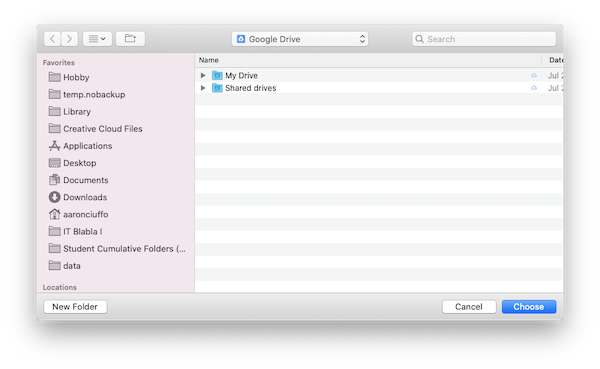

# insert_files
insert_files files into Student Cumulative Folders on Google Drive.

## Quick Start

1. [Google FileStream](https://dl.google.com/drive-file-stream/GoogleDriveFileStream.dmg) installed and are signed in as well as a prepared student.export file from PowerSchool.
1. Download the application from [this link](https://github.com/txoof/insertFiles/raw/master/insert_files.tgz)
2. Locate the file `insert_files.tgz` -- likely in your `Downloads` folder
3. Double click on the file to decompress it
4. Locate the insert_files icon and drag it into your `Applications` folder
5. Locate the insert_files icon in your `Applications` folder and double click on it to run
    * If you receive error messages or popups preventing you from running the application see the [Help](#Help) section
7. Click "Insert Files" button to begin inserting files.
6. If this is the first time you have run this program, you will be asked to choose a Google Shared drive **and** cumulative student folder. 
    * If you are unsure how to do this, see the [Help](#Help) section
8. When prompted slect a student export file to process by clicking "Browse"

Each of the files to be "inserted" must have a PowerSchool student number in the file name. If a matching student number is found on the Google Shared drive, the file will be copied into the student folder. 

## Requirements
Insert files depends on Google File Stream with an authenticated user that has write permissions to the Student Portfolio Folders.

## Help
### "insert_files" Cannot Be Opened

This error indicates that the program was not created by an "official" developer. In this case, this is not a problem. Take the following steps to run the program:
1. Locate the program file (likely in your `Applications` folder)
2. Right-click or ctrl-click on the file and choose "Open"
3. A pop-up window will likely appear -- *if no pop-up appears, no further action is needed*
    
4. Read the text and choose "Open" -- *this will permenently allow you to open this application by double clicking on the icon*
    * If you download a new version of the application, you *may* need to repeat these steps
    
### Choosing the Shared Drive and Cumulative Student Folder

createFolders needs to know both which Google Shared Drive to use and the folder where Student Cumulative Folders are stored. The first time you run createFolders, it will ask you to choose the appropriate drive and folder.

1. Click "Browse" to open a folder chooser window
    
    * If FileStream is active and working properly, you will be automatically directed to the Google Drives available to you.
3. Double click the "Shared drives" folder and locate the appropriate folder
    * This is likely called `ASH Student Cumulative Folders` or something similar
4. Locate the folder within the shared drive that contains cumulative folders and click on it
    * This is likely called `Student Cumulative Folders (AKA Student Portfolios)`
5. Click "Choose" to select the folder to return back to createFolders
6. Click "OK" to accept the shared drive
    * createFolders works very hard to ensure you have selected the appropriate drive and will try to prevent you from using an improper folder.
    * You can always change this folder later if you have made a mistake
7. Click "Process File" to begin processing a student.export file    

### Setup Google FileStream
Google FileStream is required for createFolders. The user must be signed in with an account that has write permissions to the Student Cumulative folders drive.

1. Download [Google FileStream](https://dl.google.com/drive-file-stream/GoogleDriveFileStream.dmg) and run the installer.
2. Launch Google FileStream if it is not running (look for the icon in the menu bar) and click "Sign in"
    
3. Use your @ash.nl credentials for an account that has access to the cumulative folders drive.
    * You will likely be asked to sign in using your two-step verification; this is normal
4. Click on the filestream icon in the menu bar and click on the folder icon to view your google drive files
    * It may take several minutes before your folders and files are all visible
5. Browse to the `Shared drives` and locate the `ASH Student Cumulative Folders` drive to confirm you have access
    * If you do not have access, you have likely used an account that does not have permissions. Sign out and try again.
    
### Complete Uninstall
To completely uninstall the application do the following:
1. Remove the executable `createFolders` application
2. From the terminal run `$ rm -rf ~/.config/com.txoof.insert_files`
